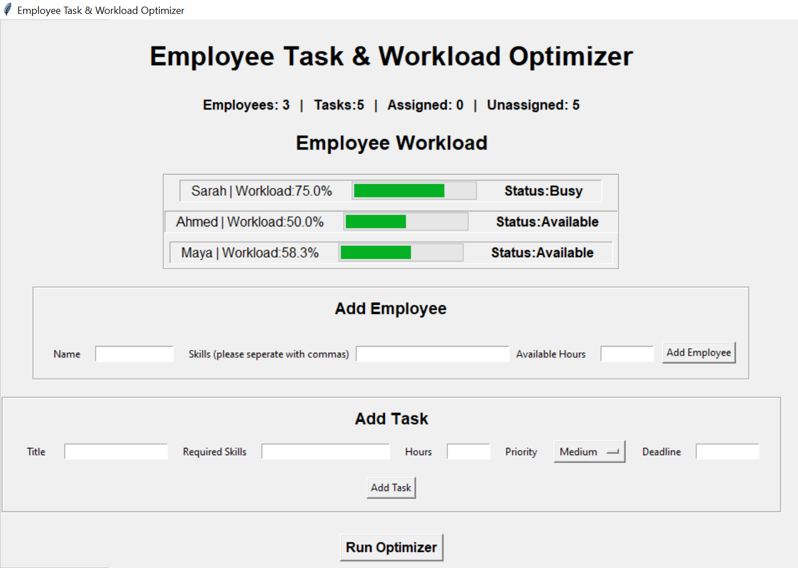
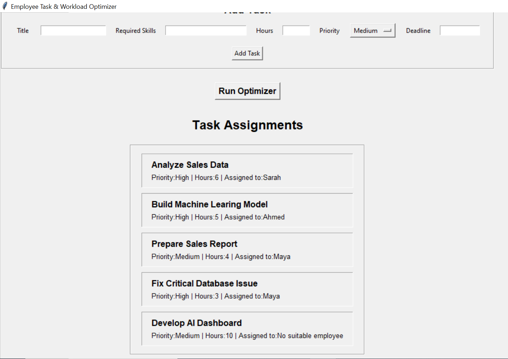

#Employee Task & Workload Optimizer

A Python desktop application that helps assign tasks to employees based on their skills, available capacity, workload, and task priority.

The application provides an interactive dashboard where users can manage employees and tasks, run the optimization algorithm, and view workload and assignment results.
## Application Preview

### Employee Workload Dashboard



### Task Assignments



## Features

- Add employees with their skills and available working hours
- Add tasks with required skills, estimated hours, priority, and deadline
- Automatically assign tasks to suitable employees
- Match employees based on required skills
- Prevent assignments that exceed employee capacity
- Prioritize high-priority tasks during optimization
- Balance assignments based on current employee workload
- Display workload percentages and employee status
- Visualize workloads using progress bars
- Display assigned and unassigned tasks
- Save employee and task data using JSON
- Restore saved data when the application is reopened
- Validate user input and display GUI error messages
- Scrollable dashboard for larger datasets

## Optimization Logic

When the optimizer runs, tasks are processed according to priority.

For each unassigned task, the application:

1. Checks which employees have the required skills.
2. Removes employees who do not have enough remaining capacity.
3. Compares the workloads of the suitable employees.
4. Assigns the task to the employee with the lowest workload percentage.
5. Updates the employee's workload and the task assignment.

This helps distribute work while respecting employee skills and capacity.

## Technologies Used

- Python
- Tkinter
- Object-Oriented Programming (OOP)
- JSON
- Data structures and sorting
- File handling

## Project Structure

```text
EmployeeTaskWorkloadOptimizer/
├── main.py
├── employee.py
├── task.py
├── optimizer.py
├── GUI.py
├── data_manager.py
├── .gitignore
└── README.md
